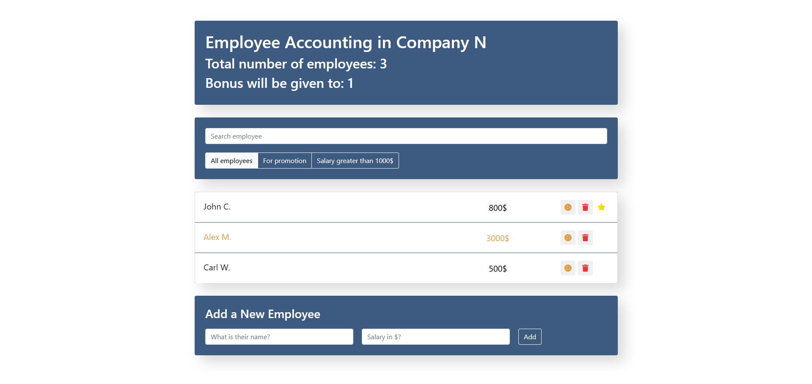

# Interactive Employee Tracker App

This React app is designed for tracking the number of employees in a company, determining who will receive a bonus, and who will get a promotion.

## Live Demo
You can view the live version of this app at:
https://sparkling-flan-5857d4.netlify.app/

## Features

- Employee Search: You can search for employees by name.
- Filtering: Filter employees who are up for a promotion or have a salary above $1000.
- Promotion: Clicking on an employee allows you to mark them for a promotion, indicated by a star icon.
- Bonus: Clicking on the cookie icon will give an employee a bonus, highlighting them in green.
- Delete & Add Employees: You can remove employees or add new ones along with their salary information.


## Technologies Used

- React: JavaScript library for building user interfaces.
- JavaScript (ES6+): The core language used for app development.
- CSS: For styling and layout of the application.
- FontAwesome: For using icons (like the cookie and star icons).
- npm: For managing dependencies and running build scripts.
- Node.js: The JavaScript runtime environment used for running the application locally.

## Installation

1. Clone the repository:
   ```bash
   https://github.com/yurazablotskiy/Employees_list.git
